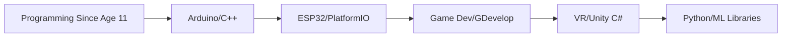

  
# 👋 Hi, I'm Hong Zhe

### 🎓 Computer Science Student @ De Anza College | 🤖 AI/ML Enthusiast | 🚀 Future Startup Founder

---

## 🎯 About Me

> "Building the future with code, one project at a time"

I'm a passionate programmer who started coding at age 11 and haven't stopped since. Currently focused on mastering full-stack development and diving deep into AI/ML. My journey has taken me from Arduino boards to VR games, and now to the exciting world of machine learning and web applications.

- 🔭 **Currently working on:** Money Manager App (React, Supabase, TypeScript)
- 🌱 **Currently learning:** The Odin Project, Prompt Engineering, Agentic AI
- 🎯 **Future goals:** Specialize in AI/ML, build a startup
- ⚡ **Fun fact:** Started programming before I was a teenager!

---

## 🛠️ Skills Timeline

### 🔙 Past Experience

<b>📚 Detailed Past Skills</b>

 

| Category | Technologies |
|----------|-------------|
| **Embedded Systems** | Arduino with C++, ESP32 with PlatformIO |
| **Game Development** | GDevelop, Unity Engine (C#), VR Development |
| **Mobile Development** | MIT App Inventor |
| **Web Foundations** | HTML, CSS, JavaScript |
| **Python Libraries** | Matplotlib, Pandas, Seaborn, Streamlit |
| **Machine Learning** | Keras, XGBoost, Scikit-learn, Ollama, Hugging Face |
| **3D Modeling** | Blender |

### 🟢 Present Focus
| Skill | Details |
|-------|---------|
| **Prompt Engineering** | Skills development, Agentic loops |
| **Vibe Coding** | Money Manager App with React, Supabase, TypeScript, TailwindCSS |
| **Full Stack Dev** | Following The Odin Project curriculum |
| **Competitive Coding** | Exploring hackathons |

### 🔮 Future Goals
- 📐 Excel in college mathematics (Calculus, Linear Algebra)
- 🤖 Specialize in AI & Machine Learning
- 🚀 Build a startup with a great team

---

## 🏆 Achievements & Awards

| Competition | Level | Achievement |
|-------------|-------|-------------|
| **YIC 2024** | State Level | 🥇 Gold Placement |
| **YIC 2024** | National Level | 🎖️ Top 15 Finalist |
| **World Youth Scientist Innovation Invention 2025** | International | 🥇 Gold Placement |
| **Next Gen Teen Exchange 2025** | Lab 1 | 🏆 Winner |
| **Next Gen Teen Exchange 2025** | Lab 2 | 🏆 Winner |
| **Next Gen Teen Exchange 2025** | Finalist Camp | 🏆 Winner |

---

## 💼 Experience

### **Chumbaka Asia** - HQ Research & Development Intern
*📍 2 Months (2026)*
- Contributed to R&D projects at the headquarters
- Developed "Game Design with GDevelop" course
- Certified by Chumbaka Asia in multiple technologies

---

## 📊 GitHub Statistics

### 🏅 GitHub Trophies

---

## 💻 Tech Stack

### Languages

### Frameworks & Libraries

### Tools & Platforms

---

## 📈 Activity Graph

---

## 📫 Let's Connect!

I'm always open to collaborating on interesting projects, hackathons, or just having a chat about tech!

---

### 💡 "The best way to predict the future is to invent it." - Alan Kay

The README showcases your impressive journey from young programmer to AI/ML enthusiast with all your achievements! 🚀
