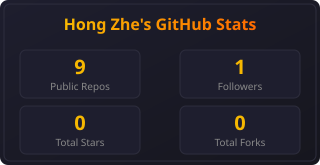
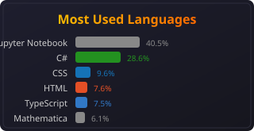

<div align="center">

<!-- Banner -->
<picture>
  <source media="(prefers-color-scheme: dark)" srcset="./assets/hzng_github_banner.png">
  <source media="(prefers-color-scheme: light)" srcset="./assets/hzng_github_banner_light.png">
  
</picture>

<!-- Animated Typing Header -->
<a href="https://git.io/typing-svg"></a>

<!-- Profile Views -->
<p>
  
</p>

<!-- Social Badges -->
<p>
  <a href="https://www.linkedin.com/in/hong-zhe-ng-0777032b2/">
    
  </a>
  <a href="https://instagram.com/hz.2707">
    
  </a>
  <a href="mailto:hzngstreamer@gmail.com">
    
  </a>
</p>

</div>

---

## 🧑‍💻 About Me

```yaml
name: Hong Zhe
education: Computer Science @ De Anza College
location: "Building the future, one commit at a time"
interests:
  - Artificial Intelligence & Machine Learning
  - Full Stack Web Development
  - VR/AR Game Development
  - Hackathons & Startup Culture
currently_learning:
  - "The Odin Project (Full Stack)"
  - Prompt Engineering & Agentic AI
  - College Mathematics (Calculus, Linear Algebra)
```

> 🎯 **Mission:** Specialize in AI & ML, find a team, and build a startup that matters.

---

## ⏳ My Journey

<table>
  <tr>
    <td width="33%" valign="top">

### 🕰️ Past
- 💻 Programming since **age 11**
- 🤖 **Chumbaka Asia Certified:**
  - Arduino (C++)
  - ESP32 (PlatformIO)
  - Mobile Apps (MIT App Inventor)
- 🎮 Game Dev with **GDevelop** — *Created a course for Chumbaka*
- 🥽 **VR Development** with Unity (C#)
- 🐍 Python ecosystem: Matplotlib, Pandas, Seaborn, Streamlit, Keras, XGBoost, Scikit-learn, Ollama, Hugging Face

  </td>
  <td width="33%" valign="top">

### ⚡ Present
- 🧠 Mastering **Prompt Engineering** & Agentic Loops
- 💰 Vibe-coding a **Money Manager App** *(React, Supabase, TypeScript, TailwindCSS)*
- 🏃 Exploring **Hackathons**
- 📚 Started **The Odin Project** for full-stack mastery

  </td>
  <td width="33%" valign="top">

### 🚀 Future
- 📐 Excel at **College Math** (Calculus, Linear Algebra)
- 🤖 **Specialize in AI & ML**
- 🚀 **Find a team & build a startup**

  </td>
  </tr>
</table>

---

## 🛠️ Tech Stack

### Languages
<p>
  
  
  
  
  
  
  
  
</p>

### Frameworks & Libraries
<p>
  
  
  
  
  
  
  
  
  
</p>

### Tools & Platforms
<p>
  
  
  
  
  
  
  
  
</p>

---

## 🏆 Achievements & Competitions

<div align="center">

| Competition | Level | Result |
|-------------|-------|--------|
| **YIC 2024** | State Level | 🥇 **Gold Placement** |
| **YIC 2024** | National Level | 🎖️ **Top 15 Finalist** |
| **World Youth Scientist Innovation Invention 2025** | International Level | 🥇 **Gold Placement** |
| **Next Gen Teen Exchange 2025 (Lab 1)** | — | 🏆 **Winner** |
| **Next Gen Teen Exchange 2025 (Lab 2)** | — | 🏆 **Winner** |
| **Next Gen Teen Exchange 2025 (Finalist Camp)** | — | 🏆 **Winner** |

</div>

---

## 💼 Experience

**🔬 HQ Research & Development Intern** @ **Chumbaka Asia** *(2026 — 2 months)*
- Developed curriculum and technical content
- Worked with Arduino, ESP32, and IoT solutions
- Contributed to ed-tech innovation in Asia

---

## 📊 GitHub Stats

<div align="center">

<!-- Streak Stats -->


<br/><br/>

<!-- Static SVGs generated by GitHub Actions (reliable, no rate limits) -->

&nbsp;&nbsp;


</div>

---

## 🌐 Connect With Me

<p align="center">
  <a href="https://www.linkedin.com/in/hong-zhe-ng-0777032b2/">
    
  </a>
  <a href="https://instagram.com/hz.2707">
    
  </a>
  <a href="mailto:hzngstreamer@gmail.com">
    
  </a>
</p>

<div align="center">

### 💡 *"Code is like humor. When you have to explain it, it's bad."* — Cory House

</div>
